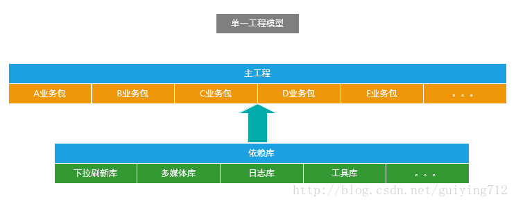
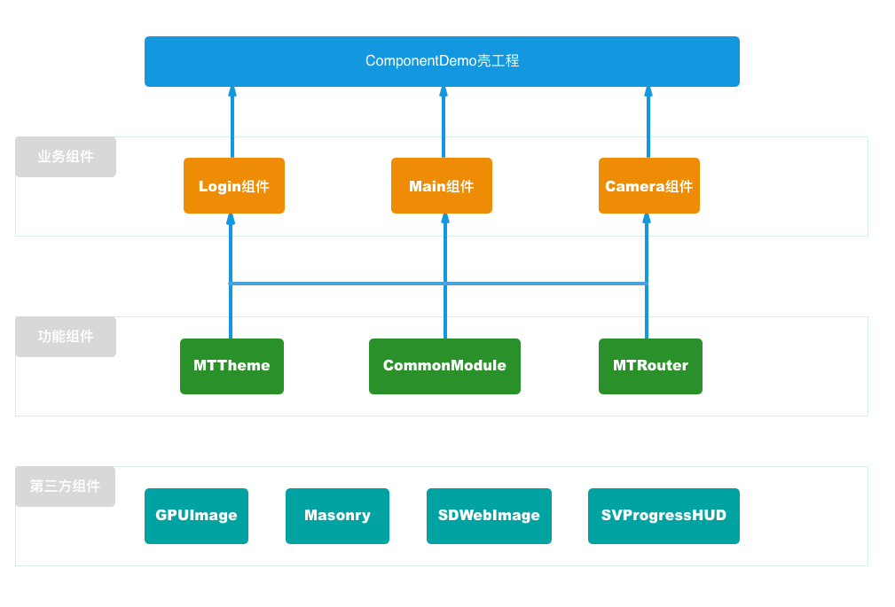

组件化方案
------
## 简述
本项目是一个组件化Demo，通过[MTTheme](https://github.com/ireliaBR/MTTheme)和[MTRouter](https://github.com/ireliaBR/MTRouter)实现业务模块的主题国际化切换和解耦

> 废话不多说，先上效果图

* 主题的切换

* 国际化的切换

## 为什么要项目组件化
随着APP版本不断的迭代，新功能的不断增加，业务也会变的越来越复杂，APP业务模块的数量有可能还会继续增加，而且每个模块的代码也变的越来越多，这样发展下去单一工程下的APP架构势必会影响开发效率，增加项目的维护成本，每个工程师都要熟悉如此之多的代码，将很难进行多人协作开发，而且Android项目在编译代码的时候电脑会非常卡，又因为单一工程下代码耦合严重，每修改一处代码后都要重新编译打包测试，导致非常耗时，最重要的是这样的代码想要做单元测试根本无从下手，所以必须要有更灵活的架构代替过去单一的工程架构。

上图是目前比较普遍使用的APP技术架构，往往是在一个界面中存在大量的业务逻辑，而业务逻辑中充斥着各种网络请求、数据操作等行为，整个项目中也没有模块的概念，只有简单的以业务逻辑划分的文件夹，并且业务之间也是直接相互调用、高度耦合在一起的。


上图单一工程模型下的业务关系，总的来说就是：你中有我，我中有你，相互依赖，无法分离。 
然而随着产品的迭代，业务越来越复杂，随之带来的是项目结构复杂度的极度增加，此时我们会面临如下几个问题：

1. 实际业务变化非常快，但是单一工程的业务模块耦合度太高，牵一发而动全身； 
2. 对工程所做的任何修改都必须要编译整个工程； 
3. 功能测试和系统测试每次都要进行； 
4. 团队协同开发存在较多的冲突.不得不花费更多的时间去沟通和协调，并且在开发过程中，任何一位成员没办法专注于自己的功能点，影响开发效率； 
5. 不能灵活的对业务模块进行配置和组装；

为了满足各个业务模块的迭代而彼此不受影响，更好的解决上面这种让人头疼的依赖关系，就需要整改App的架构。

## 组件化架构思路

上图是组件化工程模型，下面会列举一些组件化工程中名词的含义

> 集成模式

所有的业务组件被 `ComponentDemo壳工程` 依赖，组成一个完整的APP；

> 组件模式

可以独立开发业务组件，每一个业务组件就是一个APP；

> app壳工程

负责管理各个业务组件，和打包apk，没有具体的业务功能；

> 业务组件

根据公司具体业务而独立形成一个的工程；

> 功能组件

提供开发APP的某些基础功能，例如主题切换模块、路由模块；

> Main组件

属于业务组件，指定APP启动页面、主界面；

> CommonModule

属于功能组件，支撑业务组件的基础，提供多数业务组件需要的功能，例如基类，初始化配置；

## 业务模块解耦
APP组件化架构的目标是告别结构臃肿，让各个业务变得相对独立，业务组件在组件模式下可以独立开发，而在集成模式下又可以变为 `pod` 集成到 `ComponentDemo壳工程` 中，组成一个完整功能的APP


 这是组件化工程模型下的业务关系，业务之间将不再直接引用和依赖，而是通过 `MTRouter` 这样一个中转站间接产生联系，而路由实际就是对URL Scheme的封装。
如此规模大的架构整改需要付出更高的成本，还会涉及一些潜在的风险，但是整改后的架构能够带来很多好处：

1. 加快业务迭代速度，各个业务模块组件更加独立，不再出现业务耦合情况； 
2. 稳定的公共模块采用依赖库方式，提供给各个业务线使用，减少重复开发和维护工作量； 
3. 迭代频繁的业务模块采用组件方式，各业务研发可以互不干扰、提升协作效率，并控制产品质量； 
4. 为新业务随时集成提供了基础，所有业务可上可下，灵活多变； 
5. 降低团队成员熟悉项目的成本，降低项目的维护难度； 
6. 加快编译速度，提高开发效率； 
7. 控制代码权限，将代码的权限细分到更小的粒度；

## 组件化实施流程

### 解耦
在每个业务模块中添加 `Initialization` 类，将路由注册写在 +load 中， 这样在 pre-main 时就会自动注册路由

```objc
	[MTRouter.router registerUrl:@"main://homepageCtrl#fdd" controllerCls:HomePageController.class];
    [MTRouter.router registerUrl:@"main://settingCtrl#fdd" controllerCls:SettingController.class];
    [MTRouter.router registerUrl:@"main://themeCtrl#fdd" controllerCls:ThemeController.class];
    [MTRouter.router registerUrl:@"main://languageCtrl#fdd" controllerCls:LanguageController.class];
    
    [MTRouter.router registerUrl:@"main://setUserInfo" handler:^id(NSDictionary *parameters) {
        HomePageController *ctrl = (HomePageController *)parameters[@"pushCtrl"];
        NSString *username = parameters[@"username"];
        NSString *password = parameters[@"password"];
        [ctrl setUsername:username password:password];
        return nil;
    }];
```

路由触发方式：

1. handler路由触发

```objc
	[MTRouter.router executeUrl:@"main://setUserInfo"
                         parameters:NSDictionaryOfVariableBindings(pushCtrl, username, password)];
```

2. ctrl路由触发

```objc
    //push
	[MTRouter.router pushUrl:@"main://settingCtrl"
                      animated:YES
                     pushNavCtrl:self.navigationController];
    //present
    [MTRouter.router presentUrl:@"camera://cameraCtrl" animated:YES presentCtrl:self];
    
    //获取ctrl实例
    UIViewController *ctrl = [MTRouter.router executeUrl:@"main://homepageCtrl"];
```

> 具体路由设计可查看[MTRouter](https://github.com/ireliaBR/MTRouter)

### 主题国际化切换

在 `CommonModule` 中添加 `ThemeLanguageManager` 管理类，根据业务封装了具体主题国际化切换方案

1. 主题国际化的初始化

```objc
	//主题模块初始化
    NSString *path = [NSBundle mainBundle].bundlePath;
    NSString *themePath = [path stringByAppendingPathComponent:@"Theme"];
    themePath = [themePath stringByAppendingPathComponent:currentTheme];
    [MTThemeManager initializeWithDefaultThemePath:themePath];
    
    //字体模块初始化
    NSString *fontPath = [path stringByAppendingPathComponent:@"Font"];
    fontPath = [fontPath stringByAppendingPathComponent:currentLanguage];
    [MTFontManager initializeWithDefaultFontPath:fontPath];
```

2. 主题国际化的视图注册

```objc
	//国际化
	[_nameLabel theme_setTextColorIdentifier:@"SettingController.cell.nameLabel.textColor"
                                      moduleName:@"main"];
                                      
    //图片
    [_arrowImageView theme_setImageIdentifier:@"icon_setting_arrow" moduleName:@"main"];
    
    //颜色
    [_lineView theme_setBackgroundColorIdentifier:@"SettingController.cell.lineView.backgroundColor" moduleName:@"main"];
                                   
```

3. 主题国际化切换

```objc
	//主题切换
    NSString *path = [NSBundle mainBundle].bundlePath;
    NSString *themePath = [path stringByAppendingPathComponent:@"Theme"];
    themePath = [themePath stringByAppendingPathComponent:theme];
    [MTThemeManager.manager setThemePath:themePath];
    
    //国际化切换
    NSString *path = [NSBundle mainBundle].bundlePath;
    NSString *fontPath = [path stringByAppendingPathComponent:@"Font"];
    fontPath = [fontPath stringByAppendingPathComponent:language];
    [MTFontManager.manager setFontPath:fontPath];
```

> 具体主题设计可查看[MTTheme](https://github.com/ireliaBR/MTTheme)

### PrefixHeader
由于项目中需要用到常用的宏命令，所以将所有的宏命令和 `CommonModule` 的基类在了 `CommonModule` 下的 `CommonModule.h` 中。

### 各模块资源文件的导入
在业务模块中获取图片无法使用 `imageNamed:` ，因为此方法是在 `MainBundle` 路径中加载，需要使用 `imageNamed:inBundle:compatibleWithTraitCollection:` 方法指定Bundle路径，可以在每个业务模块的 `PrefixHeader.h` 中添加本模块图片加载宏命令

## 未来优化
1. 由于pod使用了静态库的方式导入，在业务模块中的资源文件全部放到了MainBundle中，后期每个模块建立bundle包
2. 本地国际化有时候无效
3. 由于项目规模太小，去中心化意义不大，后期针对性讲解下去中心化的概念
4. 业务模块和功能模块使用 `python` 编写自动化静态库编译脚本，实现源码和静态库的自动切换

## 结语
> 您的star，是我前进的动力^_^